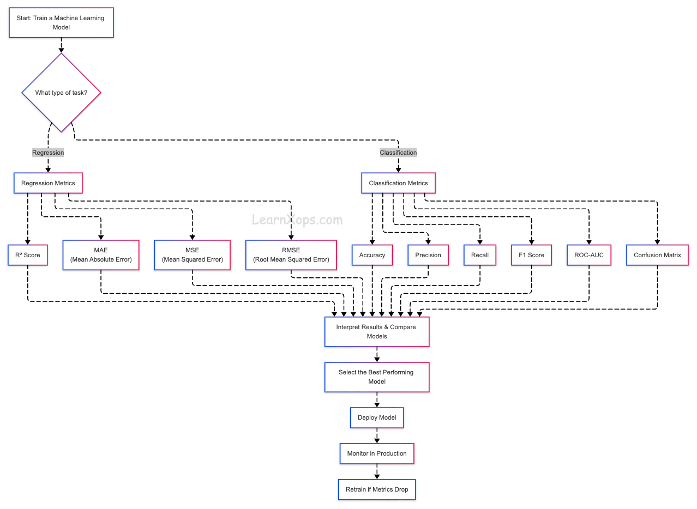

#Model Evalution & Metrics - Measure What Matters

# Ml Evalution Metrics 

**Machine Learning(ML) evalution metrcis are quantitive measures used to access how well model performs. These metrics vary depending on the type of ml task:

